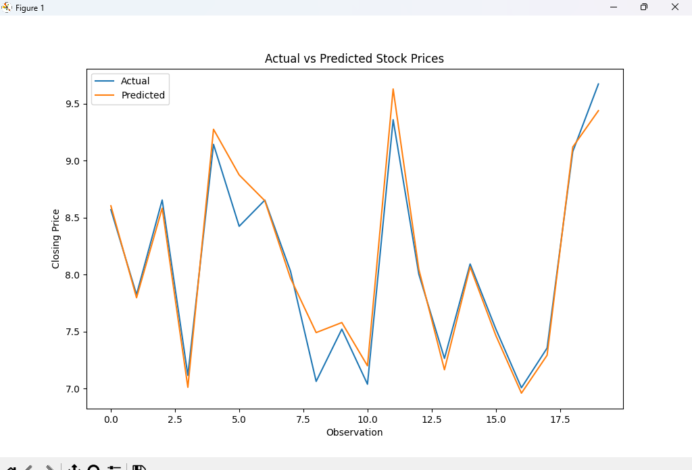

# Stock Prices Analysis and Prediction

This code performs analysis and prediction of stock prices using historical data. The steps include data preprocessing, visualization, feature engineering, model training, and evaluation. The prediction model used is Linear Regression.

## Author

This code is written by Muhammad Yousaf.
Email: yousafsahiwal3@gmail.com

## Requirements

- Python 3.x
- numpy
- pandas
- matplotlib
- seaborn
- scikit-learn

You can install the required packages using the following command:

```bash
pip install numpy pandas matplotlib seaborn scikit-learn
```

## Dataset

The dataset used for this analysis should be named `stock_prices.csv` and placed in the same directory as the script.

## Steps

1. **Load and Explore the Dataset**
2. **Data Preprocessing**
3. **Data Visualization**
4. **Feature Engineering**
5. **Model Training and Prediction**
6. **Evaluation of the Model**

## Usage

1. Place the dataset `stock_prices.csv` in the same directory as the script.
2. Run the script using the following command:

```bash
python stock_prices_analysis.py
```

## Code

```python
import numpy as np
import matplotlib.pyplot as plt
import pandas as pd
import seaborn as sns
import datetime
from sklearn.model_selection import train_test_split
from sklearn.linear_model import LinearRegression
from sklearn.metrics import mean_squared_error, r2_score

df = pd.read_csv('stock_prices.csv')

print("First few rows of the dataset:")
print(df.head())

print("\nInformation of Dataset:")
print(df.info())

print("\nSummary Statistics:")
print(df.describe())

df['Date'] = pd.to_datetime(df['Date'])
df = df.sort_values(by='Date')
df.set_index('Date', inplace=True)

plt.figure(figsize=(12, 6))
plt.plot(df['Close'])
plt.title('Stock Prices Over Time')
plt.xlabel('Date')
plt.ylabel('Closing Price')
plt.show()

print("\nMissing Values:")
print(df.isnull().sum())

df.fillna(method='ffill', inplace=True)
df['Close_Lag1'] = df['Close'].shift(1)
df['Close_Lag2'] = df['Close'].shift(2)
df['Close_Lag3'] = df['Close'].shift(3)
df.dropna(inplace=True)

X = df[['Close_Lag1', 'Close_Lag2', 'Close_Lag3']]
y = df['Close']

X_train, X_test, y_train, y_test = train_test_split(X, y, test_size=0.2, random_state=42)

model = LinearRegression()
model.fit(X_train, y_train)

y_pred = model.predict(X_test)

mse = mean_squared_error(y_test, y_pred)
r2 = r2_score(y_test, y_pred)

print(f"\nMean Squared Error: {mse}")
print(f"R^2 Score: {r2}")

plt.figure(figsize=(12, 6))
plt.plot(y_test.values, label='Actual')
plt.plot(y_pred, label='Predicted')
plt.legend()
plt.title('Actual vs Predicted Stock Prices')
plt.xlabel('Observation')
plt.ylabel('Closing Price')
plt.show()
```

## Generated Figures

### Stock Prices Over Time

_fig.png)

### Actual vs Predicted Stock Prices



## Explanation

- **Load and Explore the Dataset:** The dataset is loaded and basic information and summary statistics are displayed.
- **Data Preprocessing:** The 'Date' column is converted to datetime format, sorted, and set as the index. Missing values are filled using forward fill.
- **Data Visualization:** The closing prices are plotted to visualize the trend over time.
- **Feature Engineering:** Lag features (`Close_Lag1`, `Close_Lag2`, `Close_Lag3`) are created to use past values for prediction.
- **Model Training and Prediction:** The dataset is split into training and testing sets. A Linear Regression model is trained on the training set, and predictions are made on the testing set.
- **Evaluation of the Model:** The Mean Squared Error (MSE) and R^2 score are calculated to evaluate the model. A plot is created to visualize the actual vs predicted stock prices.

## Contact

For any inquiries, please contact Muhammad Yousaf at yousafsahiwal3@gmail.com.

---
